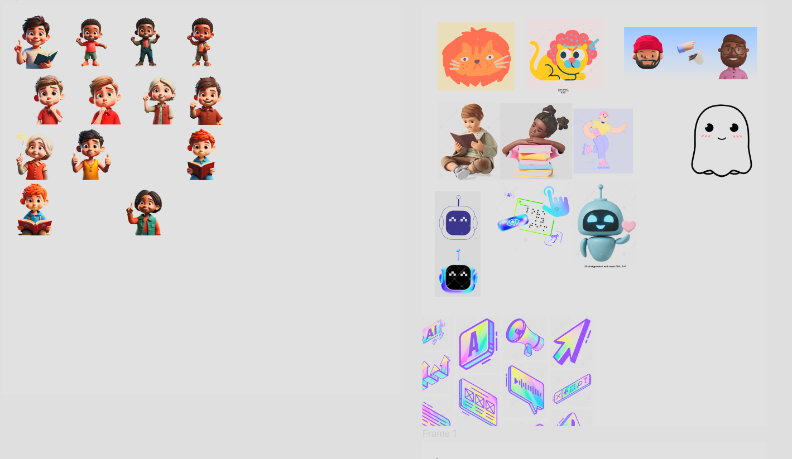
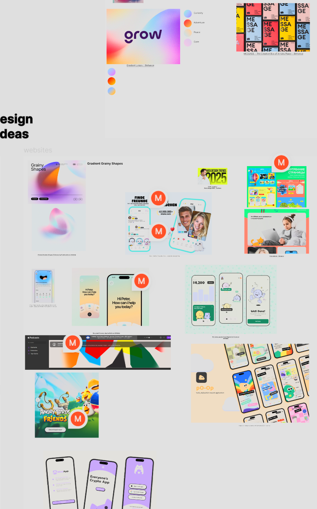
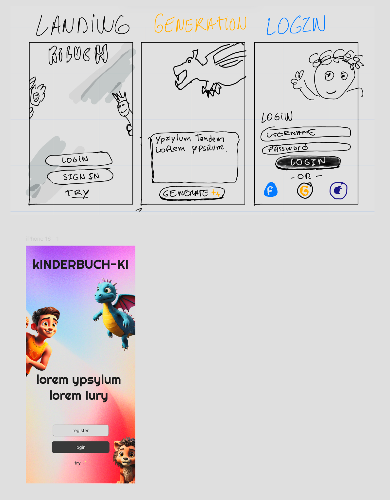
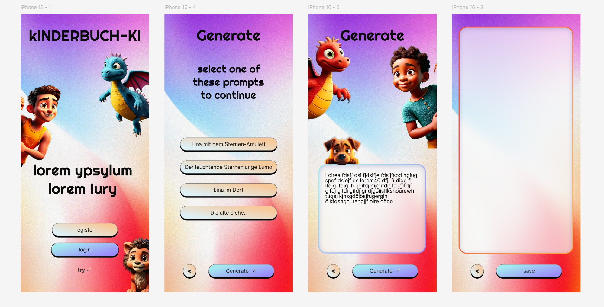

#03.02

- Generation of avatars/research on style

#04.02 

- Research on Fonts and some UI/UX

# 5.02

-Wireframes and prototyping 

# 06/07.02

# 08.02

-doing some frontend and doing design

# 10.11

--learning nextjs and doing frontend

# 11.02

-learning nextjs and doing frontend

# 12.02

-did login, register and improved landing page in frontend

#13.02

-Did the dashboard page, login is working, registering a new user too. First steps of the generator app and more

#14.02

-geerator page in progress

#17.02 

-generate page done

#18.02

-bug fixes

#19.02 

-Bug fixed and now login
